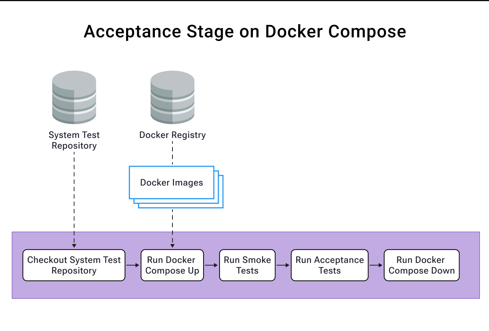

# Digital Kudos Wall

A web application that lets colleagues publicly recognize each other's great work, fostering a culture of appreciation and visibility within teams.

## 1. Project Members

**Project Member(s):** Individual Subscription - Working individually on this project to demonstrate XP, CD, and lean product development practices.

## 2. Version Control

**Version Control System:** Git  
**Hosting Platform:** GitHub

## 3. System Name

**Digital Kudos Wall** - A recognition platform for team achievements and contributions.

## 4. System Repository

This is the main system repository for the Digital Kudos Wall project.

**Contributors:**

- Individual developer following XP and CD principles
- Inspired by the work of Kent Beck, Martin Fowler, Dave Farley, Robert C. Martin, Marty Cagan, Dan North, and other lean/agile thought leaders

## 5. System Use Cases

### Primary Use Cases:

- **Give Kudos** - Tech Leads can create and submit kudos for team members
- **View Kudos Wall** - All users can view publicly displayed kudos
- **User Authentication** - Users can register and login to access the platform
- **Analytics Dashboard** - Users can view recognition trends and insights

### Primary Actors:

- **Tech Lead** - Can create kudos and view the wall
- **Team Member** - Can view kudos wall and analytics

### User Story Map Reference:

See [USER_STORY_MAP.md](./USER_STORY_MAP.md) and [user-story-map.pdf](./docs/user-story-map.pdf) for detailed user journeys and MVP scope.

## 6. External Systems

**External I/O Systems:**

- Public REST APIs for potential integrations
- Email system for notifications (future consideration)

**External Non-deterministic Systems:**

- System Clock for timestamps
- User authentication services

## 7. System Architecture Style

**Architecture:** Frontend + Microservice Backend

The system follows a clean, simple architecture suitable for the MVP scope while allowing for future scalability.

## 8. Architecture Diagram

The system consists of:

**Components:**

- Frontend (Web Application)
- Backend (API Server)
- Database (Data Storage)

**Relationships:**

- Frontend communicates with Backend via REST API
- Backend manages data persistence through Database
- All components support the core user journeys defined in the User Story Map

_Architecture diagram to be added_

## 9. Tech Stack

**Programming Languages:**

- TypeScript/JavaScript
- HTML/CSS

**Frontend Framework:**

- React.js with modern tooling

**Backend Framework:**

- Node.js with Express.js

**Database:**

- PostgreSQL (for production)
- SQLite (for development/testing)

**Additional Tools:**

- Jest for testing
- ESLint for code quality
- Prettier for code formatting

## 10. Repository Strategy

**Multi-Repository Approach** - Separate repositories for different concerns:

- **digital-kudos-wall** (this repo) - Main project documentation and workspace configuration
- **digital-kudos-wall-frontend** - React frontend application
- **digital-kudos-wall-backend** - Node.js backend API
- **digital-kudos-wall-system-tests** - Acceptance and E2E tests using Dave Farley's Four-Layer Model

## 11. Branching Strategy

**Feature Branching** - Trunk Based Development

## 12. Deployment Model

**Initial Setup:**

- **Local Development:** Docker containers for a consistent development environment, local database setup, and hot reloading for rapid feedback.

  - **Running System-Level Tests Locally (Acceptance Stage on Docker Compose):**
    To run smoke and acceptance tests locally against containerized services, the `digital-kudos-wall-system-tests` repository provides a Docker Compose setup. This allows for testing the integrated system in an environment that closely mimics CI/CD stages.

    

    **Steps:**

    1. Navigate to the `digital-kudos-wall-system-tests` directory.
    2. Ensure you have the latest service images: `docker compose pull frontend backend`
    3. Start services: `docker compose up -d --remove-orphans`
    4. Run tests:
       - Smoke tests: `npm run test:smoke`
       - Acceptance tests: `npm run test:acceptance`
    5. Stop services: `docker compose down`

- **UAT Environment (AWS):** The system is deployed to a User Acceptance Testing (UAT) environment on AWS.
  - **Infrastructure:** Managed by Terraform, consisting of a single EC2 instance running Docker.
  - **Services:** Frontend and Backend applications are run as Docker containers, orchestrated by Docker Compose on the EC2 instance.
  - **Database:** SQLite is used, with data stored on the EC2 instance's local storage.
  - **Deployment:** Automated via GitHub Actions, which triggers Terraform to apply infrastructure changes and update services.

## 13. CI/CD Pipeline

**Pipeline Architecture:** Following a TDD-supporting pipeline design, focusing on fast feedback and reliable deployments.

**Pipeline Tool:** GitHub Actions
**Container Registry:** GitHub Container Registry
**Deployment Mechanism:** Terraform (for infrastructure and service updates on EC2)
**Docker Strategy:** Containerized deployments for all components.

**Pipeline Stages:**

The goal is to implement the following stages:

1.  **Commit Stage (Per Component: Frontend, Backend)**

    - Runs on every push to feature branches and main branch.
    - Checkout code.
    - Compile code (if applicable).
    - Run unit tests.
    - Run component tests.
    - Run contract verification tests (e.g., Pact).
    - Perform linting and static code analysis.
    - Build Docker image.
    - Push Docker image to GitHub Container Registry (tagged with commit hash or version).

    

    

2.  **Release Stage (Integrated System to UAT)**

    - Triggered automatically after all relevant component commit stages pass (e.g., on merge to main for frontend or backend).
    - Or, can be triggered manually for specific branches/versions.
    - **Deploy to UAT Environment (Release to UAT):**
      - GitHub Actions workflow retrieves the latest (or specified) Docker image URIs for frontend and backend.
      - Triggers `terraform apply` in the `digital-kudos-wall-infrastructure` repository, passing the image URIs to update the EC2 instance's Docker Compose configuration via `user_data.sh`.
    - Run smoke tests against the UAT environment.
    - Run automated acceptance tests (e.g., end-to-end tests using the system-tests repository) against the UAT environment. (Note: Currently, acceptance tests are run on the UAT environment. A separate, dedicated acceptance environment/stage is a future consideration.)

    ")

    

3.  **UAT Stage (Manual Verification)**

    - The UAT environment, once deployed (as per the Acceptance Stage), is available for manual QA testing and stakeholder review.
    - Smoke tests ensure basic functionality post-deployment.

    

4.  **Staging Stage (Future - Pre-production Validation)**

    - Deploy to a staging environment (mimicking production).
    - Run smoke tests and potentially other checks (performance, final soak tests).

5.  **Production Stage (Future - Live Deployment)**

    - Deploy to the production environment.
    - Run smoke tests.
    - Monitor closely.

    

**Component Pipeline Strategy:**

- Each application repository (Frontend, Backend) will have its own GitHub Actions workflow for the Commit Stage.
- The `digital-kudos-wall-infrastructure` repository will have a GitHub Actions workflow for deploying to UAT (and later, other environments).
- System tests in `digital-kudos-wall-system-tests` will be triggered as part of the Acceptance Stage.
- Focus is on fast feedback loops and ensuring each component is releasable independently.
- Visibility into pipeline status will be provided through GitHub Actions' UI. (Further dashboarding can be discussed based on clarification).

## 14. Component Repositories

**Links to Component Repositories:**

- [Frontend Repository](https://github.com/chirag1507/digital-kudos-wall-frontend) - React web application
- [Backend Repository](https://github.com/chirag1507/digital-kudos-wall-backend) - Node.js API server
- [System Tests Repository](https://github.com/chirag1507/digital-kudos-wall-system-tests) - Smoke, Acceptance and E2E tests

## 15. Project Management

**Project Board:** GitHub Projects for ticket management and user story tracking

**Approach:** Single project board for the entire system with:

- User Stories from the story map
- Bug tracking
- Task lists for frontend and backend work
- Multiple assignees per ticket when needed

## 16. Development Approach

This project follows:

- **Extreme Programming (XP)** practices
- **Continuous Delivery (CD)** principles
- **Lean Product Development** methodology
- **User Story Mapping** for feature prioritization
- **Test-Driven Development** where appropriate
- **Small batch sizes** and frequent integration

### MVP Focus

The current MVP includes:

- User registration and authentication
- Kudos creation (Tech Leads only)
- Basic kudos wall display
- Simple, clean user interface

Future iterations will add filtering, search, analytics, and enhanced user experience features.

## Getting Started

1. Clone this repository and the component repositories
2. Open the `digital-kudos-wall.code-workspace` file in your IDE for multi-repo development
3. Follow setup instructions in individual component repositories
4. Refer to the User Story Map for understanding user journeys and priorities

## Documentation

- [User Story Map](./USER_STORY_MAP.md) - Detailed user journeys and MVP definition
- [Visual Story Map](./docs/user-story-map.pdf) - Visual representation of the story mapping session

---

_This project demonstrates modern software development practices including lean product development, continuous delivery, and user-centered design._
